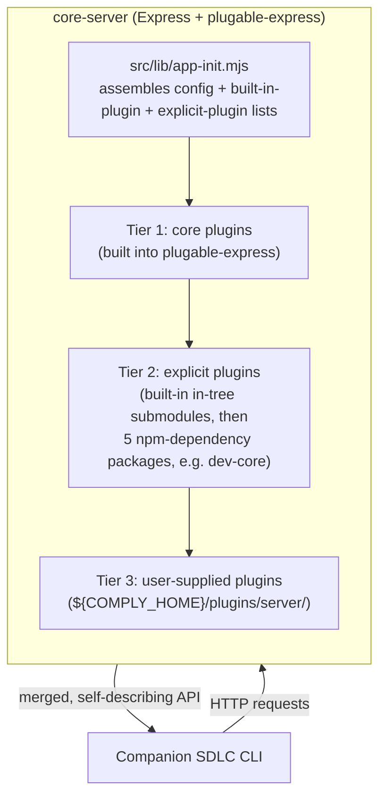

# Architecture

## Purpose and scope

This document describes *how* `@sdlcforge/core-server` is structured internally: its major pieces, how they relate, and the rationale behind non-obvious design choices. It complements [`docs/core-server-spec.md`](./core-server-spec.md), which states *what* the server does and is required to do. Build, test, and lint commands live in `AGENTS.md`; this document does not restate them.

## System overview

`core-server` is an Express-based HTTP server whose own codebase is intentionally minimal. Nearly all runtime behavior — request handling, route registration, and plugin lifecycle — is delegated to `@liquid-labs/plugable-express`. `core-server`'s job is to assemble configuration, its own built-in-plugin aggregate, and an explicit-plugin list, then hand initialization off to that library. The companion SDLC CLI (currently `@liquid-labs/sdlcpilot-cli`, migrating to `@sdlcforge/sdlc-cli`) is the server's primary client: it drives SDLC tooling, integrations, and workflow automation for a team by issuing HTTP requests against the running server.

Plugins are the unit of capability. They load across three tiers, in a fixed order, so that a later tier can extend or override capability without requiring a change to an earlier one: **core** plugins built into `@liquid-labs/plugable-express`, **explicit** plugins declared by `core-server` itself — both its own built-in (in-tree) submodules and npm-dependency packages — and **user-supplied** plugins discovered at `${COMPLY_HOME}/plugins/server/`. Once loaded, every plugin's routes are merged into a single registered API surface, which the server exposes to clients for self-description (`/server/api`, `/server/plugins/list`).

<!-- For AI agents and non-visual readers: this diagram shows the companion CLI issuing HTTP requests to core-server, which loads three plugin tiers in order (core, explicit — built-in in-tree submodules then npm-dependency packages, user-supplied) and merges their routes into one registered API surface exposed back to the CLI. -->

## Tech stack

- **Runtime:** Node.js, `>=18.0.0` (validated across 18–24 by the Docker multi-version test suite).
- **Language:** ES6+ source, transpiled to CommonJS via Babel for the published artifacts.
- **Package management:** Bun (`bun install`, `bun.lock`) installs the dependency tree; Node and npm remain required on a contributor's `PATH` for the Catalyst build/lint/test toolchain — `npm explore` resolves each tool's config path, and every Catalyst CLI is itself a Node-targeted tool regardless of which package manager populated `node_modules`.
- **HTTP framework:** Express, via `@liquid-labs/plugable-express`.
- **Plugin/extensibility framework:** `@liquid-labs/plugable-express` — owns request handling, plugin loading, and route aggregation; `core-server` configures rather than reimplements this.
- **Configuration:** `@liquid-labs/comply-defaults` — resolves server name, port, API spec path, plugin directory, server configuration root, and home directory.
- **Build:** Makefile (Catalyst framework, modular `make/*.mk` files) driving Rollup bundling and Babel transpilation.
- **Test:** Jest with Supertest for unit tests; Docker (Ubuntu + nvm) for multi-version integration tests.
- **Local dev loop:** yalc, for iterating on `@liquid-labs/plugable-express` in parallel with `core-server` without a publish cycle.

## Major components

### Core initialization

`src/lib/app-init.mjs` is the server's own primary logic: it resolves configuration through `@liquid-labs/comply-defaults`, builds the fixed `explicitPlugins` list (5 npm packages) and the `builtinPlugins` in-tree-submodule aggregate (from `src/lib/builtin-plugins.mjs`), resolves the user-plugin directory (`${COMPLY_SERVER_PLUGIN_DIR()}/server`), and calls `@liquid-labs/plugable-express`'s `appInit`, passing all of the above plus `serverConfigRoot` and `dynamicPluginInstallDir`. `serverConfigRoot` resolves through `COMPLY_SERVER_CONFIG_ROOT()` to `${XDG_DATA_HOME}/sdlcforge-core/` (defaulting `XDG_DATA_HOME` to `${HOME}/.local/share`) — a user-level data location rather than `core-server`'s own installed-package directory — so this is where server configuration state, including the `server-settings.yaml` file `@liquid-labs/plugable-express` reads at init, now lives. Because that move would otherwise silently drop the `registries:` list the repository's packaged `server-settings.yaml` carries, `app-init.mjs` seeds the packaged defaults into the resolved root on first run: only when no file already exists at the destination, and only when the caller has not supplied its own `serverConfigRoot`, so a first server start still finds its `registries:` configuration instead of the empty object `@liquid-labs/plugable-express` writes when the file is absent. `src/lib/index.js` re-exports `appInit` plus `Reporter` (from `plugable-express`) as the library's public surface. `src/cli/index.js` is the executable entry point: it resolves the port via `COMPLY_PORT()` and calls `plugable-express`'s `startServer` with `appInit`, producing the standalone CLI artifact.

### Plugin system

Three plugin tiers load in a fixed order — core, explicit, user-supplied — so each later tier can extend or override capability without a change to an earlier one. The explicit tier itself has two sources, registered in a fixed sub-order: `core-server`'s own built-in (in-tree) submodules — `src/controls/`, `src/credentials/`, `src/integrations-issues-github/`, aggregated by `src/lib/builtin-plugins.mjs` and registered under `@sdlcforge/core-server`'s own package identity — register first, immediately followed by a static list of 5 npm-dependency packages — `@sdlcforge/dev-core` plus four `@liquid-labs/sdlc-projects-*` workflow/badges packages — declared directly in `app-init.mjs`. The user tier is dynamic: any plugin package placed under `${COMPLY_HOME}/plugins/server/` is picked up on the next server start, letting a project maintainer extend server capability without modifying `core-server`'s own source or dependency set. This loading model, its ordering guarantees, and the full explicit-plugin list are detailed in [`docs/architecture/plugin-loading-tiers.md`](./architecture/plugin-loading-tiers.md).

### Build pipeline

The build is Makefile-driven (Catalyst framework), not a bare `npm run build`/`bun run build` script: `Makefile` includes every `make/*.mk` file in `make/`, numbered by priority (`10-locations.mk` through `95-final-targets.mk`). Two Rollup targets consume this same transpiled source tree and produce two distinct `dist/` artifacts — an importable library (`dist/sdlcforge-server.js`, from `src/lib/index.js`) and a standalone executable (`dist/sdlcforge-server-exec.js`, from `src/cli/index.js`, with a `#!/usr/bin/env -S node --enable-source-maps` preamble and executable bit set). Babel transpiles the ES6+ source to CommonJS for both. The pipeline is wired into the npm publish lifecycle via `package.json`'s `prepack` and `preversion` hooks, so a published package always carries freshly-built, tested artifacts. Bun installing the dependency tree in place of npm changed none of this: `make/10-resources.mk`'s `npm explore … -- pwd` config-path lookups and every `npx babel`/`npx rollup` invocation resolve identically against a Bun-installed `node_modules`, and no `make/*.mk` file was modified to get there — those files are generated by `@liquid-labs/catalyst-lib-makefiles` and `@liquid-labs/catalyst-builder-node`, so a hand-edit would be lost on the next regeneration.

### Test infrastructure

Three test levels give increasing confidence at increasing cost: Jest unit tests (`src/lib/test/*.test.js`) validate app initialization and library exports in isolation; a local integration pass (`test/test-server.js`) starts the real server on the current Node version and exercises its core endpoints; a Docker-based multi-version pass (`test/run-integration-tests.sh`) runs the same kind of check across every supported Node version (18–24) inside Ubuntu containers provisioned with nvm. The Docker pass exists primarily to catch explicit-plugin loading regressions — the 5-package npm-dependency install is the part of startup most exposed to Node-version and network variance — rather than to re-verify unit-level correctness already covered by Jest.

## Key decisions

- **Delegate to `@liquid-labs/plugable-express` rather than build a bespoke server framework.** Keeps `core-server`'s own codebase minimal and puts route handling, plugin lifecycle, and request dispatch in one shared, independently-versioned library that other `@liquid-labs`/`@sdlcforge` servers can also depend on.
- **Three-tier, fixed-order plugin loading.** Ordering (core, then explicit, then user) is the mechanism that lets a later tier extend or override an earlier one's capability without editing that earlier tier's code — the load-bearing property behind "all capability is plugin-delivered."
- **Dual build artifacts from one source tree.** A single Rollup config, driven twice with different entry points and output settings, produces both a `require()`-able library and a self-executing CLI, so the ES6+ source is authored once but consumed both ways.
- **Configuration centralized through `@liquid-labs/comply-defaults`.** Server name, port, API spec path, plugin directory, server configuration root, and home directory are all resolved through one shared resolver rather than scattered `process.env` reads across the codebase, keeping configuration behavior consistent with sibling `@liquid-labs`/`@sdlcforge` tools that use the same resolver.
- **yalc for local `plugable-express` development.** Because `core-server` depends so heavily on `@liquid-labs/plugable-express`, the project accepts a `.yalc/`-based local-linking workflow over a full publish/install cycle for that one dependency during active parallel development; the day-to-day commands for this workflow live in `AGENTS.md`, not here. Under Bun this carries a consequence npm never had: once `bun.lock` holds a resolved entry for a `file:.yalc/…` specifier, a bare `bun install` re-copies the linked package's content but does not re-resolve its own dependency list, so it silently leaves a newly-added transitive dependency unresolved while still reporting success. A `yalc push` that changed the linked package's `dependencies` therefore requires `rm -f bun.lock && bun install` (or `scripts/provision-local-deps.sh --refresh-lock`) to pick the change up.

## Security model

`core-server` does not implement its own authentication or authorization layer; that responsibility is delegated outward. Request handling and any auth/session concerns `@liquid-labs/plugable-express` provides apply uniformly to core, explicit, and user-supplied plugin routes alike, since all three tiers register through the same mechanism. Credential storage and retrieval for third-party integrations is handled by `core-server`'s own built-in `credentials` submodule (`src/credentials/`, registered through the `builtinPlugins` mechanism described in [`docs/architecture/plugin-loading-tiers.md`](./architecture/plugin-loading-tiers.md#built-in-in-tree-plugins)) rather than being mixed into `app-init.mjs`'s own initialization logic, keeping secret-handling logic modularized in its own submodule rather than scattered through the rest of the codebase.

## API architecture

The server's registered HTTP surface is the union of a small set of fixed core routes and whatever routes the loaded plugins (across all three tiers) contribute; `@liquid-labs/plugable-express` aggregates these into one surface as plugins load, which is what makes `/server/api` able to report the *actual* live capability of a given running instance rather than a static, hand-maintained list. The fixed core routes and their contracts are defined in [`docs/core-server-spec.md`](./core-server-spec.md#api-definition); this document only covers how the surface is assembled, not the per-route contract.

## Pointers

- [`docs/core-server-spec.md`](./core-server-spec.md) — the functional specification (*what* the server does and must do).
- [`docs/architecture/plugin-loading-tiers.md`](./architecture/plugin-loading-tiers.md) — the three-tier plugin loading model in depth.
- [`AGENTS.md`](../AGENTS.md) — build, test, and lint commands, and other developer/agent working notes.
- [`docs/project-structure.md`](./project-structure.md) — repository layout reference.
- [`README.md`](../README.md) — consumer-facing project overview and entry point.
