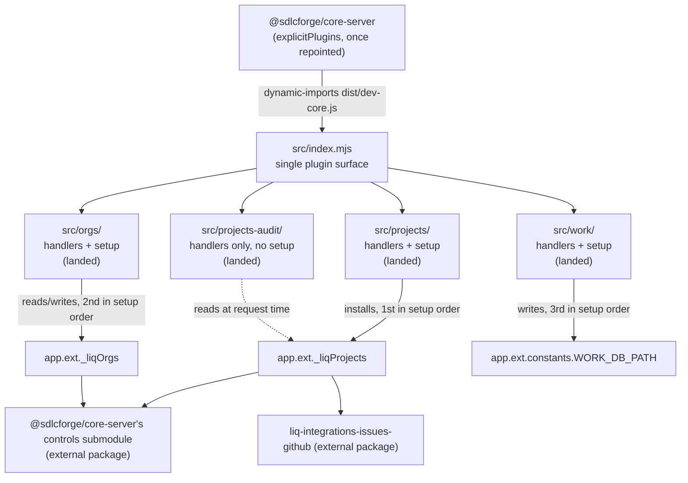
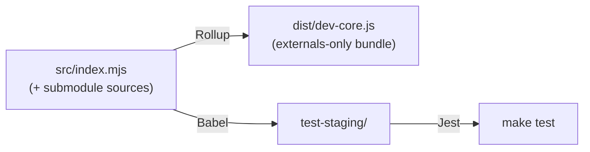

# Architecture

## Purpose and scope

This document describes the structural shape of `@sdlcforge/dev-core`: what the package is in the wider system, how its submodules decompose, the single aggregation boundary they compose through, the composite-`setup` ordering contract, the runtime `app.ext` service contracts that couple submodules to each other and to code outside this package, the route namespaces each submodule owns, and the build/artifact pipeline that turns the source tree into the published bundle.

It does not cover per-endpoint parameter reference (that lives in the route tables in [`README.md`](../README.md)), the absorption *procedure* for bringing a new submodule in (that is [`docs/dev-core-consolidation-contract.md`](./dev-core-consolidation-contract.md)), or the specific edits a consumer must make to repoint from a superseded donor package (that is [`docs/consumer-migration.md`](./consumer-migration.md)).

## System overview

`@sdlcforge/dev-core` is a `plugable-express` plugin for `@sdlcforge/core-server`. It consolidates development-lifecycle capability that previously shipped as four separate `plugable-express` plugin packages — `@liquid-labs/liq-projects`, `@liquid-labs/liq-orgs`, `@liquid-labs/liq-work`, and `@liquid-labs/plugable-projects-audit` — into one package with one build, one release cycle, and one explicit statement of the runtime contracts those four packages used to share implicitly across separate repositories.

All four donors have landed: `projects`, `orgs`, `work`, and `projects-audit` are absorbed and live under `src/`. `core-server`'s own `explicitPlugins` list has not yet been repointed from the four donor packages to `@sdlcforge/dev-core` — that repointing is a separate, later step, specified per-donor in [`docs/consumer-migration.md`](./consumer-migration.md), not performed by this package itself.



<!-- For AI agents and non-visual readers: the diagram above shows core-server dynamic-importing dist/dev-core.js, which resolves to the single aggregator src/index.mjs. The aggregator composes all four landed submodules: projects, orgs, and work each contribute handlers and a setup, while projects-audit contributes handlers only and has no setup at all. Each of the three submodules with a setup installs or maintains its own app.ext key, in the fixed order projects, then orgs, then work; projects-audit contributes no key of its own but reads app.ext._liqProjects at request time (dashed edge). Two of those keys (app.ext._liqProjects and app.ext._liqOrgs) are also read by external packages outside this consolidation, @sdlcforge/core-server's in-tree controls submodule and liq-integrations-issues-github. -->

The remaining sections detail each part of this picture: the submodule decomposition, the aggregation boundary, the setup-ordering contract, the `app.ext` service contracts (including the external consumers the diagram only names), the route namespaces, and the build/artifact topology.

## Submodule decomposition

Each absorbed package gets exactly one top-level directory under `src/`, named for its domain, exposing `handlers` and — where the donor had one — `setup` through its own `index.mjs`. No submodule imports another; the four donors never imported each other before consolidation, and that stays true after it (verified: `src/projects/`, `src/orgs/`, `src/work/`, and `src/projects-audit/` each import only from their own subtree and from external npm dependencies).

| Submodule | Status | Absorbed from | `index.mjs` exports |
|---|---|---|---|
| `src/projects/` | Landed | `@liquid-labs/liq-projects` | `handlers`, `setup` |
| `src/orgs/` | Landed | `@liquid-labs/liq-orgs` | `handlers`, `setup` |
| `src/work/` | Landed | `@liquid-labs/liq-work` | `handlers`, `setup` |
| `src/projects-audit/` | Landed | `@liquid-labs/plugable-projects-audit` | `handlers` only — no `setup` |

`projects-audit` stays a separate top-level directory from `projects` even though both mount under the `/projects` route namespace — folding them together would re-couple two independently-absorbed submodules for no structural benefit, per [the consolidation contract's layout convention](./dev-core-consolidation-contract.md#layout-convention).

`projects-audit` is the one submodule with no `setup`, and it is also the clearest illustration of why the absence of a `setup` is not the absence of a dependency: its handlers read `app.ext._liqProjects` at request time, and two of its four routes carry a `:projectName` segment whose path variable only `projects`' `setup` registers — so registering its handlers without `projects` present throws at server startup. The full statement of that coupling lives in [`README.md`](../README.md#the-projects-audit--projects-dependency).

## The aggregation boundary

`src/index.mjs` is this package's single plugin surface — the one place all submodules compose. That is a direct consequence of how `plugable-express`'s loader (`load-plugins.js`) works: it dynamic-imports exactly one module per package (`<pluginDir>/<package.json main>`) and reads only two exports from it, `handlers` and `setup` — nothing else the module exports is read. A package cannot register more than one plugin's worth of routes and setup by exporting more from other files; everything has to fold into the one module the loader actually imports.

The aggregator therefore builds one fresh, merged `handlers` array by spreading all four submodules' own `handlers` arrays (never by `push`ing into an imported array, since two submodules mutating a shared array would be a latent aliasing bug once they share one package), and one composite `setup` function that awaits each submodule's own `setup` in a fixed order (see [The composite-setup ordering contract](#the-composite-setup-ordering-contract) below).

The aggregator is also the one file in this package that a careless absorption can silently destroy, which is why [the consolidation contract](./dev-core-consolidation-contract.md#root-file-ownership) calls it out by name: `plugable-projects-audit`'s own root entry point was literally `src/index.mjs` — the same path — and resolving that merge conflict the wrong way would have replaced this aggregator with a one-line re-export, dropping three submodules' handlers and the entire composite `setup` while still producing a valid module and a green `make build`.

The plugin's identity in the server comes from the package manifest, not the module: `plugable-express`'s loader reads `npmName` from `package.json`'s `name` and the server-visible plugin `summary` from `package.json`'s `description`. One consequence follows directly: every endpoint's recorded provenance `npmName` is `@sdlcforge/dev-core`, regardless of which submodule it came from — a visible, permanent change in the server's generated API spec and `help` output relative to when each submodule shipped as its own plugin.

## The composite-setup ordering contract

`src/index.mjs`'s `setup` is `async` and awaits each submodule's own setup that has one, in this fixed order: **`projects` first, then `orgs`, then `work`.** `projects-audit` contributes no `setup` at all — handlers only — and is deliberately absent from the ordered list rather than represented there by a placeholder or a no-op.

The ordering is load-bearing in exactly one place, not uniformly:

- **`projects` must run first.** Its setup is eager — it registers GitHub credentials via `@liquid-labs/credentials-db-plugin-github`'s `setupCredentials`, creates the developer's playground directory, and installs `app.ext._liqProjects = { playgroundMonitor, playgroundPath }` — synchronously, before returning. `orgs`' deferred `load orgs` setup method (see below) reads `app.ext._liqProjects.playgroundMonitor` once the framework runs it, so that key must already exist by then.
- **`orgs`' own `setup` call does not itself depend on `projects`.** It is synchronous, returns `undefined`, and only pushes three entries onto `app.ext.setupMethods` (`plugable-express`'s own deferred-work queue, drained by its `DependencyRunner` after every plugin's `setup` has returned) plus registers the `orgKey`/`newOrgKey` path variables. It is the *deferred* `load orgs` method — not `orgs`' `setup` call itself — that actually reads `app.ext._liqProjects`. Keeping `orgs` second is still correct, since the deferred method still needs `projects`' installation to have already happened by the time it runs; a passing composite-setup smoke test alone does not, on its own, prove this dependency, because it does not exercise the deferred `load orgs` method.
- **`work`'s third position is a fixed convention, not a dependency it satisfies.** `work`'s setup reads only `app.ext.serverConfigRoot`, which `plugable-express` itself supplies to every plugin's `setup` regardless of submodule order — nothing about `work`'s setup requires `projects` or `orgs` to have run first. `work`'s setup is synchronous and returns `undefined`, exactly like `orgs`'.

`registerPathVar` is forwarded to each submodule's setup unchanged. The merged set of path variables the three submodules with a `setup` register — `projectName`, `newProjectName` (from `projects`), `orgKey`, `newOrgKey` (from `orgs`), `workKey` (from `work`) — has no name collisions, which matters because a collision does not fail gracefully: `registerPathVar` **throws** `Path variable '<name>' is already registered.` on a second registration for the same name, crashing server startup. A sixth name, `parameterKey`, is registered not from any submodule's `setup` but from `orgs`' `parameters-detail.mjs` handler's `func`, at route-registration time — `plugable-express` invokes a handler's `func` once at registration specifically to give it the chance to register its own path variables, so the full merged path-variable surface is not determined by reading each submodule's `setup` function alone. `projects-audit` registers none, but *consumes* one: two of its routes reference `:projectName`, and `plugable-express`'s `pathToRe` throws `Unknown variable path element type 'projectName' …` for an unregistered variable, so this submodule's registration depends on `projects`' setup having already run — a second, registration-time face of the same ordering contract.

## Runtime service contracts (`app.ext`)

The submodules that live in this one package still share no import edge with each other — exactly as their donor packages shared none before consolidation. Their coupling is, and remains, entirely through runtime state hung off `app.ext`. That coupling is now *declared* rather than only discoverable by reading source: `package.json` carries a `"plugable"` block, `@liquid-labs/plugable-express`'s compile-time plugin manifest, that states each key below as a `provides`/`requires` pair over the framework's capability vocabulary so a build/CI-time gate can check it — see [`README.md`'s "The plugin manifest"](../README.md#the-plugin-manifest) for the full declaration and the reasoning behind each phase choice; it is not repeated here. The manifest is build/CI-time data only — nothing reads it at boot, and the couplings below are unchanged at runtime by its existence. **The table below still describes the couplings as they exist today; the manifest is what now makes them checkable from outside this package's source, not a change to what they are.**

| `app.ext` key | Set by (this package) | Read by (this package) | Read by (outside this package) |
|---|---|---|---|
| `app.ext._liqProjects` (`{ playgroundMonitor, playgroundPath }`) | `src/projects/setup.mjs`, synchronously, before `setup` returns | `src/orgs/setup.mjs`'s deferred `load orgs` method; `src/orgs/handlers/create.mjs` (`playgroundPath`, to validate `localDataRoot` containment before any filesystem write); 24 call sites across 12 modules under `src/work/`, all unconditional and unguarded; 2 call sites under `src/projects-audit/`, likewise unguarded | `@sdlcforge/core-server`'s in-tree `controls` submodule (`src/controls/integrations/get-question-controls.mjs`) — the in-tree successor to the now-deprecated `@liquid-labs/liq-controls` package; `liq-integrations-issues-github` (`src/create-or-update-pull-request.mjs`) |
| `app.ext._liqOrgs` (`{ orgs, orgSetupMethods }`) | `src/orgs/setup.mjs`'s deferred `load orgs`/`prepare org dependencies` methods | `orgs`' own `list`, `parameters-list`, `parameters-detail`, and `parameters-set` handlers (via `src/orgs/handlers/_lib/get-org.mjs`, or directly in `list.mjs`) | `@sdlcforge/core-server`'s in-tree `controls` submodule (`src/controls/resources/load-controls.mjs`, `src/controls/integrations/get-question-controls.mjs`, `src/controls/handlers/orgs/controls/_lib/list-lib.mjs`) — the in-tree successor to the now-deprecated `@liquid-labs/liq-controls` package |
| `app.ext.constants.WORK_DB_PATH` (`<serverConfigRoot>/work/work-db.yaml`) | `src/work/setup.mjs`, from `app.ext.serverConfigRoot` | `src/work/handlers/_lib/work-db.mjs` (via `WorkDB`) | — |
| `app.ext.setupMethods` | `plugable-express` itself (the deferred-work queue) | `src/orgs/setup.mjs` pushes three entries onto it | `liq-policy` (`src/liq-policy/setup.mjs`) pushes entries `orgs`' deferred `process org setup` method later drains |

Every key this package itself sets — `app.ext._liqProjects`, `app.ext._liqOrgs`, and `app.ext.constants.WORK_DB_PATH` — is now declared in the manifest as a capability the owning submodule `provides`. What is deliberately **not** yet checkable *from this package's own side* is the "read by outside this package" column above: `liq-integrations-issues-github` and `liq-policy` carry no manifest of their own, but `@sdlcforge/core-server` does — its own `"plugable"` block declares a `requires` on `appExt:_liqOrgs.orgs` (both `setup`- and `runtime`-phase) and on `appExt:_liqProjects.playgroundMonitor` from its `controls` component, the requiring counterpart to two of this package's declared `provides`. That counterpart is checked only by `core-server`'s own plugin-graph gate, not by anything in this package's build/CI, so from `dev-core`'s own vantage its declared `provides` (and, for `app.ext._liqOrgs.orgSetupMethods`, its declared `requires` on `liq-policy`'s contribution) still have no counterpart this package can itself resolve against. That gap is an intended, recorded outcome of the declaration rather than something the manifest failed to close — the escape hatch for an unmanifested counterpart is sited at a future host's gate, not at this package.

One further coupling has no `app.ext` key at all, which is exactly why it was easy to miss: `src/projects/setup.mjs` calls `setupCredentials({ credentialsDB })` from `@liquid-labs/credentials-db-plugin-github`, registering a `GITHUB_API` credential type on the shared `credentialsDB`. `liq-integrations-issues-github` (`src/create-or-update-pull-request.mjs`) later calls `credentialsDB.getToken('GITHUB_API')`, a load-order-dependent contract that only works because `projects` runs first in the composite `setup` and registers that credential type before anything else's setup runs. On this package's own side it is no longer undeclared: the manifest declares it as `credential:GITHUB_API`, a `provides` on `projects`, matched in-package by a `requires` on both `projects` and `work` themselves — see [`README.md`'s naming-commitment writeup](../README.md#the-plugin-manifest) for the full reasoning and the framework worked-example spelling it follows. Several handlers inside this package itself (`src/projects/handlers/_lib/{archive,rename,destroy}-lib.mjs`, `src/projects/handlers/releases/_lib/do-github-release.mjs`, and multiple `src/work/` handlers) also call `credDB.getToken('GITHUB_API')`, now declared rather than undeclared. `liq-integrations-issues-github`'s own read remains outside this package's manifest, since that package carries none of its own — the same declared-on-one-side-only situation as the table above.

`app.ext._liqProjects`, `app.ext._liqOrgs`, and `app.ext.constants.WORK_DB_PATH` are frozen: no participant in this consolidation renames them, precisely because code outside this consolidation's own repositories reads them directly, as the table above shows. Renaming any of them would turn a self-contained internal restructuring into a breaking change for packages this consolidation does not otherwise touch — full detail in [the consolidation contract's `app.ext` freeze](./dev-core-consolidation-contract.md#appext-contract-freeze).

## Route namespaces

Each submodule declares its own routes via a `path` (or `paths`) export on each handler module — a handler's route is never derived from its position in the source tree, so the [layout convention](./dev-core-consolidation-contract.md#layout-convention)'s relocation of a donor's files into `src/<submodule>/` never changed the HTTP surface it exposes.

| Route namespace | Owning submodule(s) | Registered in |
|---|---|---|
| `/projects` | `projects` and `projects-audit`, sharing the namespace | `src/projects/handlers/index.js`, `src/projects/handlers/releases/index.js`, `src/projects-audit/handlers/index.mjs` |
| `/orgs` | `orgs` | `src/orgs/handlers/index.js` |
| `/work` | `work` | `src/work/handlers/index.js`, `src/work/handlers/issues/index.js`, `src/work/handlers/projects/index.js` |

`projects` and `projects-audit` sharing `/projects` is a deliberate outcome of the layout convention: they stay separate top-level `src/` directories even while sharing a route prefix, so folding them together later is optional cosmetic follow-up, never a consolidation requirement. The two contribute disjoint path sets — `projects-audit`'s `audit`/`audit-fix` appear nowhere among `projects`' own 19 paths — which matters because a duplicate command path is a hard startup crash (`Non-unique command path: <path>`), not a silent shadow. The exact per-endpoint method/path tables for all four submodules — including the 19 + 5 + 30 + 4 = 58 endpoints currently registered — live in [`README.md`](../README.md#routes) rather than being duplicated here.

## Build and artifact topology



<!-- For AI agents and non-visual readers: the diagram above shows one source tree feeding two independent build outputs — Rollup bundles src/index.mjs (and everything it imports) into dist/dev-core.js as an externals-only bundle (npm dependencies are not inlined), while Babel separately transpiles the same sources into test-staging/, which Jest runs against for make test. -->

`dev-core` builds through the same Make-based toolchain its submodules already used before absorption: Babel transpiles into `test-staging/` (Jest runs against that transpiled output, not the raw `.mjs` sources), Rollup bundles `src/index.mjs` into `dist/dev-core.js` as an externals-only build (this package's own npm dependencies are not inlined into the bundle), and ESLint lints. This is deliberately not Bun and not a toolchain redesign — full rationale in [the consolidation contract's toolchain section](./dev-core-consolidation-contract.md#toolchain).

One toolchain detail is load-bearing for how a submodule is wired into the aggregator: submodule imports in `src/index.mjs` must be extensionless directory imports (`from './orgs'`, never `from './orgs/index.mjs'`). Rollup resolves either form, but Babel emits `test-staging/<submodule>/index.js` from an `.mjs` source without rewriting import specifiers, so an explicit `.mjs` specifier builds cleanly under Rollup and then fails module resolution under Jest.

```bash
make build   # Babel + Rollup -> dist/dev-core.js
make test    # Jest, via a Babel-transpiled test-staging/ build
make lint    # ESLint
make qa      # test + lint
```

## Pointers

- [`README.md`](../README.md) — the consumer-facing overview, the per-submodule route tables, and the composition/loading narrative this document's structural account complements.
- [`docs/dev-core-consolidation-contract.md`](./dev-core-consolidation-contract.md) — the standing reference for the layout convention, submodule interface, root-file ownership, absorption recipe, and the `app.ext` freeze this document assumes throughout.
- [`docs/consumer-migration.md`](./consumer-migration.md) — the per-donor specification of the exact edits `@sdlcforge/core-server` must make to repoint from each absorbed donor package to this one, including why an unsynchronized swap crashes the server rather than silently shadowing routes.
