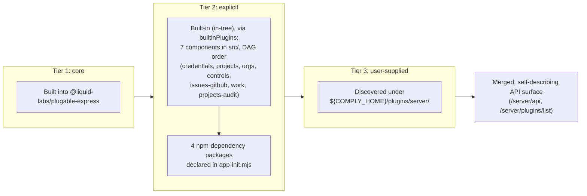

# Plugin Loading Tiers

## Purpose and scope

`core-server` delivers essentially all of its capability through plugins loaded by `@liquid-labs/plugable-express`, across three fixed-order tiers. [`docs/architecture.md`](../architecture.md#plugin-system) introduces the tier model at a glance; this document is the deep treatment: the full ordering and override semantics, the complete explicit-plugin list and what each package contributes, and the `${COMPLY_HOME}/plugins/server/` user-tier discovery mechanism, including how that path resolves and how an operator can override it. It does not cover the internal implementation of `@liquid-labs/plugable-express` itself (a separate, independently-versioned library `core-server` depends on rather than reimplements) beyond the configuration surface `core-server` passes into it.

## Table of contents

1. [Tier ordering and override semantics](#tier-ordering-and-override-semantics)
2. [Tier 1: core plugins](#tier-1-core-plugins)
3. [Tier 2: explicit plugins](#tier-2-explicit-plugins)
4. [Tier 3: user-supplied plugins](#tier-3-user-supplied-plugins)
5. [Configuration surface](#configuration-surface)
6. [Related documents](#related-documents)

## Tier ordering and override semantics

`src/lib/app-init.mjs` is where `core-server` assembles configuration and hands off to `@liquid-labs/plugable-express`'s `appInit`. The three tiers always load in the same fixed order:

<!-- For AI agents and non-visual readers: this diagram shows the fixed load order — core plugins first, then Tier 2's built-in (in-tree) 7-component aggregate followed by the 4 explicit npm-dependency plugins declared in app-init.mjs (both gated together by skipCorePlugins), then any user-supplied plugins discovered under ${COMPLY_HOME}/plugins/server/ — with each tier's routes merging into one aggregated API surface. -->



Ordering is what makes the tiers a *hierarchy of override* rather than three independent, unordered sources of routes: because `@liquid-labs/plugable-express` merges each tier's contributed handlers into the same aggregated handler set in this fixed sequence, a later tier can register a route that a plugin from an earlier tier already registered, and it takes effect without requiring any change to the earlier tier's code or `core-server`'s own source. This is the load-bearing property behind "all capability is plugin-delivered" — a project maintainer extends or overrides server behavior by adding a package to a later tier, never by patching an earlier one.

`core-server`'s own contribution to this mechanism is entirely configuration: it does not implement route merging, conflict resolution, or handler dispatch itself. The exact merge and override mechanics (how a later handler at the same path and method supersedes an earlier one) are implemented inside `@liquid-labs/plugable-express`; that library's own documentation is the canonical source for those internals. `app-init.mjs` does not pass `skipCorePlugins`, so tier 1 always loads.

Tier 2 itself has two sources, registered in a fixed sub-order: `core-server`'s own built-in (in-tree) submodule aggregate registers first, immediately followed by npm-discovered explicit-tier packages. Both are gated by the same `skipCorePlugins` flag — see [Built-in (in-tree) plugins](#built-in-in-tree-plugins) below.

## Tier 1: core plugins

Core plugins are built directly into `@liquid-labs/plugable-express` and load automatically as part of its `appInit`, before any tier `core-server` itself configures. `core-server` exercises no control over which core plugins load or what they contribute — that surface belongs entirely to `@liquid-labs/plugable-express`.

## Tier 2: explicit plugins

### Built-in (in-tree) plugins

`core-server` carries seven plugin components directly in its own source tree rather than as installed npm packages: `src/credentials/` (credential storage and retrieval for third-party integrations), `src/projects/` (project lifecycle management), `src/orgs/` (organization settings), `src/controls/` (policy controls), `src/integrations-issues-github/` (a GitHub issue-tracking integration adapter — no routes, hooks only; declared manifest name `issues-github`), `src/work/` (unit-of-work orchestration), and `src/projects-audit/` (project dependency auditing — handlers only, no `setup`). Four of the seven — `projects`, `orgs`, `work`, `projects-audit` — arrived through this project's absorption of the formerly-separate `@sdlcforge/dev-core` npm package, which ceased to exist as a distinct dependency once its submodules moved in-tree; the other three were absorbed in an earlier consolidation. `src/lib/builtin-plugins.mjs` aggregates all seven, via namespace imports, into a single already-imported plugin module and hands it to `@liquid-labs/plugable-express`'s `appInit` through its `builtinPlugins` option, which `src/lib/app-init.mjs` populates as `builtinPluginsFor({ npmName: pkgName, version: pkgVersion })` — `pkgName`/`pkgVersion` read from `core-server`'s own `package.json`. That is a deliberate identity choice: all seven components register as one `@sdlcforge/core-server` entry rather than seven separately-named ones, so `GET /server/plugins/list`, `GET /server/plugins/integrations/list`, and every route these components contribute all attribute the capability to `@sdlcforge/core-server` itself.

`builtinPlugins` registration runs inside `appInit` at the same point in the sequence, and through the same code path, that npm-discovered explicit-tier plugins occupy — immediately before them — so absorbed handlers land in `app.ext.pendingHandlers` before the error middleware is installed and before the API-spec file is written, exactly like any other plugin. Because an in-tree component is in the server package directory more literally than a `node_modules` one, `skipCorePlugins: true` suppresses it exactly as it suppresses npm-discovered explicit-tier discovery — the two are gated together, not independently.

**Component order is load-bearing, and declared twice.** `src/lib/builtin-plugins.mjs`'s `submodules` array registers the seven components in a fixed dependency (DAG) order — `credentials, projects, orgs, controls, issues-github, work, projects-audit` — because their `setup` calls run sequentially and several depend on an earlier one's `setup` having already run: `projects`' setup eagerly calls into `credentials`' `app.ext.credentialsDB`; `orgs`' deferred setup work reads `app.ext._liqProjects`, which `projects`' setup installs; and `controls` requires the capability `appExt:_liqOrgs.orgs` at the same (`setup`) phase `orgs` provides it, which the compile-time plugin-graph validator (`@liquid-labs/plugable-express`'s `validatePluginSet()`) can only resolve as `satisfied-by-source-order` if `orgs` is declared ahead of `controls`. That same order is declared a second time, independently, in `package.json`'s `plugable.host.builtins[0].components` array — the manifest the validator actually reads — and `src/lib/test/host-declaration.test.js` asserts the two arrays agree element-for-element, since nothing in `verifyHostDeclaration()` itself catches the two silently drifting apart (its order check compares `npmName` sequences across `builtinPlugins` *entries*, of which this host has exactly one, and its component check is a set comparison against a `manifest` key `builtinPluginsFor()` never supplies).

**No component imports another.** `controls`' `src/controls/resources/load-controls.mjs` (`app.ext._liqOrgs.orgs`) and `src/controls/integrations/get-question-controls.mjs` (`app.ext._liqOrgs.orgs`, `app.ext._liqProjects.playgroundMonitor`) now read those contracts from co-located, in-tree components (`orgs`, `projects`) rather than from a separate installed package, but the *mechanism* is unchanged: components couple only through `app.ext` runtime state and the capabilities each declares in the manifest above, never by importing each other's modules directly. `controls`' `'load org controls'` setup method still declares `deps: ['load orgs']` (a method `orgs` contributes), checked by `@liquid-labs/dependency-runner` and asserted in `src/lib/test/builtin-plugins.test.js`.

**A previously latent startup-failure risk is now closed.** Before the dev-core absorption, `orgs` and `projects` arrived as part of a separate, optional npm-dependency plugin (`@sdlcforge/dev-core`): nothing enforced the `_liqProjects`/`_liqOrgs` half of this coupling at startup, so a deployment that included `controls` but never loaded `dev-core` would not fail until `controls`' code actually read `app.ext._liqOrgs`/`app.ext._liqProjects` at request time — a startup-time gap that only surfaced as a runtime crash. That gap is mechanically closed by this project's absorption of `dev-core`'s submodules: `orgs` and `projects` are now built-in components in the very same `submodules` array as `controls`, ordered ahead of it (see [Component order is load-bearing, and declared twice](#built-in-in-tree-plugins) above), so the built-in aggregate cannot register `controls` without also registering `orgs` and `projects` first — the missing-component deployment state that made the risk latent can no longer occur. The direct `app.ext._liqOrgs`/`app.ext._liqProjects` property reads themselves remain a plain runtime contract rather than a framework-checked capability (unlike the `deps: ['load orgs']` setup-method dependency above, which `@liquid-labs/dependency-runner` does check), but with `orgs`/`projects` guaranteed to run first, those properties are always populated by the time `controls`' code reads them.

A root `.eslintrc.cjs` mechanically forbids the module-import route across all seven `src/<component>/` directories (`import/no-restricted-paths`, seven zones), replacing the enforcement a package boundary used to provide for free before `projects`/`orgs`/`work`/`projects-audit` lost theirs; `src/lib/test/component-boundary.test.js` guards the rule against going silently inert. See [`docs/architecture.md`'s Plugin system section](../architecture.md#plugin-system) for the full component list and DAG-order rationale.

The `builtinPlugins`/`explicitPlugins` split documented here is the current mechanism for declaring `core-server`'s own plugin set. A compile-time plugin manifest for the *built-in* tier has already landed and is mechanically enforced — `package.json`'s `plugable.host.builtins[0].components` array, validated by `make/56-plugin-graph.mk` (`src/lib/test/plugin-graph-gate.test.js`'s `validatePluginSet()` assertion) — but it coexists with the runtime `explicitPlugins` array below rather than superseding it; the explicit tier remains a plain array literal with no compile-time manifest of its own. Whether or when that might change is not yet scheduled.

### The explicit-tier package list

The explicit tier is a static, ordered array literal, `explicitPlugins`, declared directly in `src/lib/app-init.mjs` and passed straight through to `appInit`. Every entry is also a regular `dependencies` entry in `package.json`, so the tier's full package set installs alongside `core-server` itself rather than being fetched dynamically at startup. As of this writing the array holds exactly 4 packages, in this order:

| # | Package | What it contributes |
|---|---------|----------------------|
| 1 | `@liquid-labs/sdlc-projects-badges-coverage` | Generates coverage badges from a project's local `clover.xml` results (per the package's own description). |
| 2 | `@liquid-labs/sdlc-projects-badges-github-workflows` | Adds GitHub Workflow status badges to a project's `README.md` (per the package's own description). |
| 3 | `@liquid-labs/sdlc-projects-workflow-github-node-jest-cicd` | Generates GitHub Workflows CI/CD configuration for Node.js/Jest unit testing (per the package's own description). |
| 4 | `@liquid-labs/sdlc-projects-workflow-local-node-build` | Installs and manages the local Node.js build workflow for a project — the local-build counterpart to the CI/CD workflow packages above. |

All four are the `sdlc-projects-workflow-*`/`sdlc-projects-badges-*` family referenced in [`docs/core-server-spec.md`](../core-server-spec.md#key-use-cases) as the mechanism behind "install optimized lint/test/build/CI-CD scripts into a project" — they are what actually write that tooling into a target project when invoked through the companion CLI. The development-lifecycle capability a fifth package, `@sdlcforge/dev-core`, once contributed here (project lifecycle management, unit-of-work orchestration, organization-level settings, project dependency auditing) is now built-in (in-tree) instead — see [Built-in (in-tree) plugins](#built-in-in-tree-plugins) above.

Because every explicit-tier package is a declared npm dependency rather than a dynamically-fetched one, the [Docker multi-version test suite](../architecture.md#test-infrastructure) exists primarily to catch loading regressions across this specific 4-package set on a fresh `npm install`, across every supported Node.js version — not to re-verify per-package internal correctness, which is each package's own responsibility.

## Tier 3: user-supplied plugins

The third tier is dynamic rather than a fixed list: any plugin package placed under a resolved plugin directory is picked up the next time the server starts, without any change to `core-server`'s own source or `package.json` dependencies.

`app-init.mjs` computes this directory as:

```js
const pluginsPath = fsPath.join(COMPLY_SERVER_PLUGIN_DIR(), 'server')
```

`COMPLY_SERVER_PLUGIN_DIR()` and the `COMPLY_HOME()` it composes with come from `@liquid-labs/comply-defaults`, and resolve as follows:

| Resolution step | Default | Override |
|---|---|---|
| `COMPLY_HOME()` | `${XDG_CONFIG_HOME}/comply-server`, or `~/.config/comply-server` if `XDG_CONFIG_HOME` is unset | `COMPLY_HOME` environment variable |
| `COMPLY_SERVER_PLUGIN_DIR()` | `${COMPLY_HOME()}/plugins` | `COMPLY_PLUGIN_PATH` environment variable (replaces the whole path, not just the `COMPLY_HOME` component) |
| `pluginsPath` (the tier-3 discovery directory) | `${COMPLY_SERVER_PLUGIN_DIR()}/server`, i.e. `${COMPLY_HOME}/plugins/server/` by default | Follows from whichever of the two overrides above is set |

This is the mechanism behind the `${COMPLY_HOME}/plugins/server/` path named throughout `core-server`'s other docs (e.g. [`docs/core-server-spec.md`](../core-server-spec.md#constraints-and-assumptions), [`AGENTS.md`](../../AGENTS.md#environment-variables-and-configuration)): it is the default resolution, reachable by leaving both `COMPLY_HOME` and `COMPLY_PLUGIN_PATH` unset, not a hardcoded literal in `core-server`'s own source. A project maintainer extends server capability purely by placing a plugin package at whichever directory this chain resolves to — no `core-server` source or dependency change required. If the resolved directory is unset (impossible, since it always resolves to a default) or empty of plugin packages, only the core and explicit-npm tiers are active, per [`docs/core-server-spec.md`](../core-server-spec.md#constraints-and-assumptions).

`app-init.mjs` also passes a related but distinct value, `dynamicPluginInstallDir: COMPLY_HOME()`, straight through to `appInit`. This is not the tier-3 *discovery* path above — it is the directory `@liquid-labs/plugable-express` uses as an *install target* when a plugin is added to the server dynamically (e.g. via its own plugin-management API), independent of where already-installed user plugins are subsequently discovered from. The two should not be conflated when reasoning about where a plugin needs to exist versus where one gets written to.

## Configuration surface

Everything `core-server` itself controls about plugin loading is expressed as one call in `src/lib/app-init.mjs` — preceded by a first-run step that seeds the packaged `server-settings.yaml` defaults into the resolved configuration root, detailed in [`docs/architecture.md`](../architecture.md#core-initialization):

```js
const appInit = async(options) => {
  if (options?.serverConfigRoot === undefined) {
    await seedServerSettings(COMPLY_SERVER_CONFIG_ROOT())
  }

  return await superInit({
    name                    : COMPLY_SERVER_CLI_NAME(),
    version                 : pkgVersion,
    apiSpecPath             : COMPLY_API_SPEC_PATH(),
    pluginsPath,
    builtinPlugins,
    explicitPlugins,
    serverConfigRoot        : COMPLY_SERVER_CONFIG_ROOT(),
    dynamicPluginInstallDir : COMPLY_HOME(),
    noAPIUpdate             : checkSdlcEnv('NO_API_UPDATE', (v) => v === 'true' || v === '1'),
    ...options
  })
}
```

`builtinPlugins`, `explicitPlugins`, and `pluginsPath` are, respectively, the built-in (in-tree) submodule aggregate, the tier-2 npm-dependency list, and the tier-3 discovery directory documented above. `serverConfigRoot` resolves through `@liquid-labs/comply-defaults`'s `COMPLY_SERVER_CONFIG_ROOT()` accessor to `${XDG_DATA_HOME}/sdlcforge-core/` — a user-level data location, distinct from `core-server`'s own installed-package directory that this value pointed at before the configuration-root relocation — and is where `@liquid-labs/plugable-express` now finds and writes server configuration state. `...options` lets a caller of `appInit` override any of the above — `src/cli/index.js` does not currently exercise this, but a consumer embedding `core-server` as a library (via `src/lib/index.js`) can.

## Related documents

- [`docs/architecture.md`](../architecture.md#plugin-system) — the architecture overview this topic hangs off; introduces the three-tier model at a glance and the plugin system's place among `core-server`'s other major components.
- [`docs/core-server-spec.md`](../core-server-spec.md#key-use-cases) — the functional requirements the plugin tiers satisfy, including the fixed load order and the user-supplied-tier extension use case.
- [`AGENTS.md`](../../AGENTS.md#environment-variables-and-configuration) — the `COMPLY_*` configuration functions in working-notes form, plus the yalc-based local development workflow for `@liquid-labs/plugable-express`.
